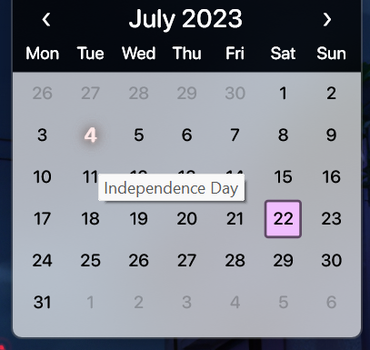

# Calendar Creation

Droptop uses [LuaCalendar](http://smurfier.github.io/LuaCalendar) to show the events in the Droptop Calendar App. It's powered by Lua, and it's very flexible and can be easily configured.&#x20;


Droptop doesn't use all the options and settings that LuaCalendar supports, so check the other existing calendars before adding unused options.


## Create a localized calendar

For every language in Droptop, a calendar can be added to show the national holidays in the Calendar App.

To create a calendar for your language, go to `Rainmeter\Skins\Droptop@Resources\Calendars` and duplicate the `Holiday.xml` file inside any of the existing folders (it's better to use the English variations).

Now you can start editing the duplicated `Holiday.xml` file, following what is already written inside the file.

The file is divided in two sections:

### Built in Holidays


```xml
<!-- Built in Holidays. Add Inactive="true" to disable. -->
<Event TimeStamp="({$Easter:Stamp}-2*{$DayNumber})">Good Friday</Event>
<Event Month="{$Easter:Month}" Day="{$Easter:Day}">Easter Sunday</Event>
<Event TimeStamp="({$Easter:Stamp}-46*{$DayNumber})">Ash Wednesday</Event>
<Event TimeStamp="({$Easter:Stamp}-47*{$DayNumber})">MardiGras</Event>-
```


In the built in holidays block you'll have to put every event that has always the same relative position in confront of built in holidays that are _**`Easter`**_, _**`OrthodoxEaster`**_, _**`GoodFriday`**_, _**`AshWednesday`**_ and _**`MardiGras`**_.

### Normal Holidays


```xml
<!-- Normal Holidays -->
<Set Month="1">
	<Event Day="1">New Years Day</Event>
	<Event Day="{$ThirdMon}">Martin Luther King, Jr. Day</Event>
</Set>
<Set Month="2">
	<Event Day="2">Groundhog Day</Event>
	<Event Day="14">Valentines Day</Event>
	<Event Day="{$ThirdMon}">Washington's Birthday</Event>
</Set>
<Event Month="3" Day="17">St. Patrick's Day</Event>
<Set Month="4">
	<Event Day="1">April Fool's Day</Event>
	<Event Day="15">Tax Day</Event>
	<Event Day="22">Earth Day</Event>
	<Event Day="{$LastFri}">Arbor Day</Event>
</Set>
<Set Month="5">
	<Event Day="5">Cinco de Mayo</Event>
	<Event Day="{$SecondSun}">Mother's Day</Event>
	<Event Day="{$LastMon}">Memorial Day</Event>
</Set>
<Set Month="6">
	<Event Day="14">Flag Day</Event>
	<Event Day="{$ThirdSun}">Father's Day</Event>
</Set>
<Event Month="7" Day="4">Independence Day</Event>
<Event Month="8" Day="26">Women's Equality Day</Event>
<Set Month="9">
	<Event Day="{$FirstMon}">Labor Day</Event>
	<Event Day="({$FirstMon}+6)">Grandparent's Day</Event>
	<Event Day="11" Year="2001" Anniversary="true">Patriot Day</Event>
	<Event Day="17">Citizen Day</Event>
</Set>
<Set Month="10">
	<Event Day="9">Leif Erikson Day</Event>
	<Event Day="{$SecondMon}">Columbus Day</Event>
	<Event Day="31">Halloween</Event>
</Set>
<Set Month="11">
	<Event Day="(({$FirstMon}+1)*(({$Year}%2)=0))">Election Day</Event>
	<Event Day="11">Veterans Day</Event>
	<Event Day="{$FourthThu}">Thanksgiving Day</Event>
</Set>
<Set Month="12">
	<Event Day="7" Year="1941" Anniversary="true">Pearl Harbor Remembrance Day</Event>
	<Event Day="21">Winter Solstice</Event>
	<Event Day="24">Christmas Eve</Event>
	<Event Day="25">Christmas Day</Event>
	<Event Day="31">New Years Eve</Event>
</Set>
```


This section is divided in months:

```xml
<Set Month="1">
	.....
	.....
</Set>
```

Inside every month there is the holiday _Event_:

```xml
<Event Day="1">New Years Day</Event>
```

Using those blocks, build your calendar with all the holidays that your country has.

#### Example

The set

```xml
<Set Month="7">
    <Event Day="4">Independence Day</Event>
</Set>
```

will generate the following event

<figure><figcaption><p>The pink square indicates today's day</p></figcaption></figure>

## Variables

You can also use some variables, such as `{$FirstMon}` or `{$Year}`. You can find every variable at [https://smurfier.github.io/LuaCalendar/#vars](https://smurfier.github.io/LuaCalendar/#vars).&#x20;
