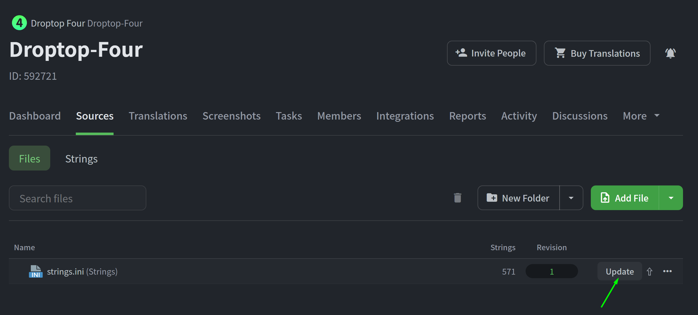
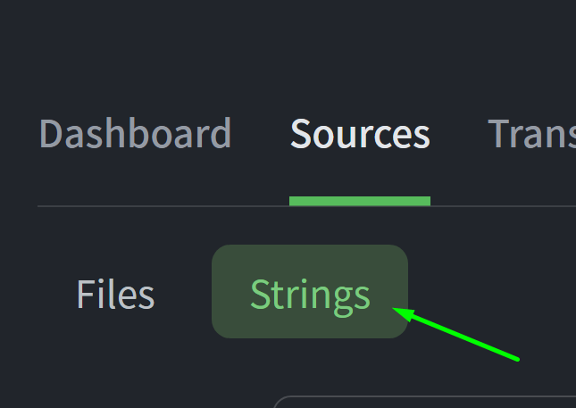
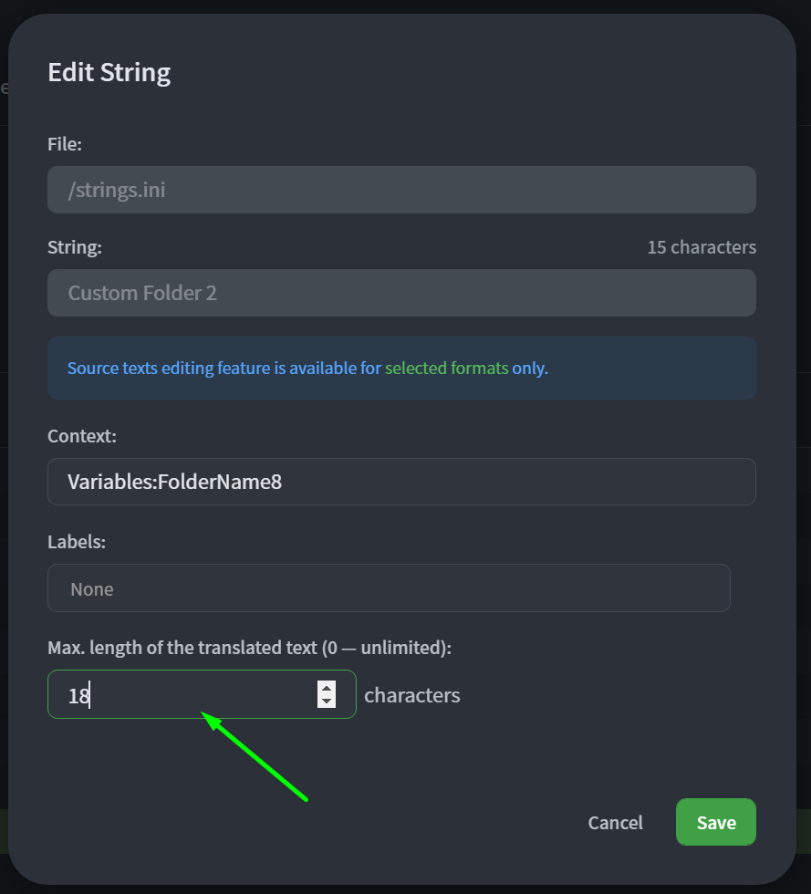
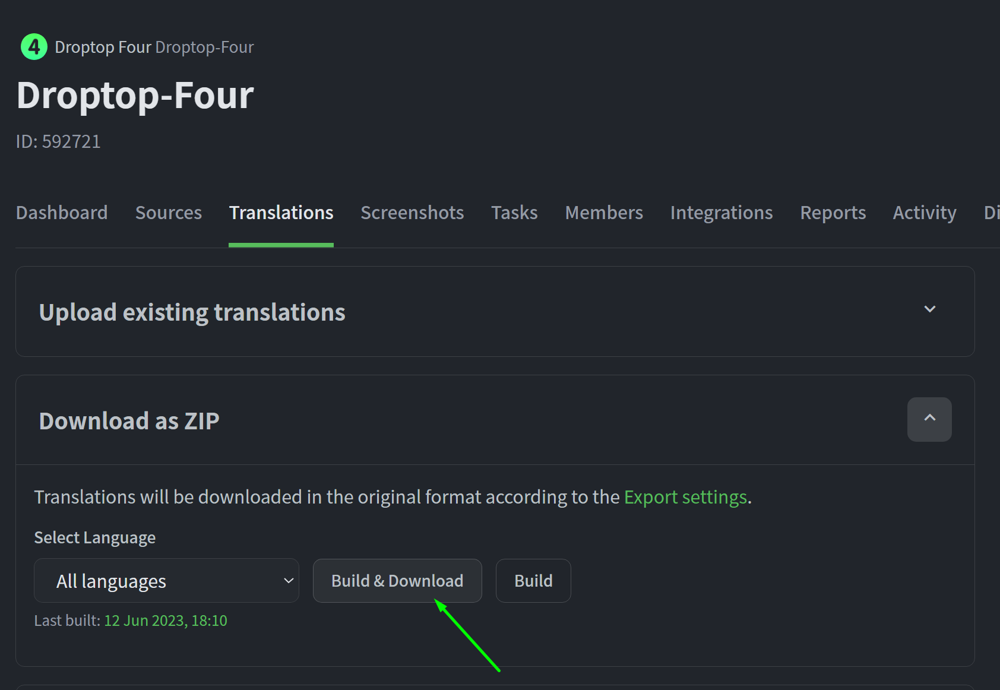

# Manage translations

## Upload new translations

To upload new translations you'll need to go to the Crowin **Sources** tab of the project, and use the `Update` button to upload a new `strings.ini` file. If there are some conflicts a pop-up will come up asking what to maintain. The new lines will be available right away.

<figure><figcaption></figcaption></figure>

### Change max length

After uploading new strings, the max lenght must be set. Head to the **Sources** tab in the project, ancd click on the **Strings** button. &#x20;

<figure><figcaption></figcaption></figure>

You'll see a list of all the strings: find the new additions, and click on the edit button and edit the `Max. lenght of the translation text` section.

<figure><figcaption></figcaption></figure>

## Download translations

To download the translations you'll need to go to the **Translations** tab, open the **Download as ZIP** toggle and click on the `Build & Download` button, making sure all languages are selected for export. This automatically starts the download of a zip folder containing the `Languages` directory with all the languages inside.


The languages are named with the locale convention. \
ex. `it-IT.inc`, `pl-PL.inc`...


<figure><figcaption></figcaption></figure>
