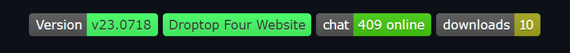

# README

When you create a community app, a README.md file will be created, as a template that can be used to standardize the possible [GitHub](https://github.com) repositories.&#x20;

To edit the file you need to know about markdown and how to use it. Check this [guide](https://docs.github.com/en/get-started/writing-on-github/getting-started-with-writing-and-formatting-on-github/basic-writing-and-formatting-syntax).

## The default file



<figure><figcaption><p>Preview of the README</p></figcaption></figure>




```markdown
<h1 align="center">
  <br>
  <a href="#"></a>
  <br>
  Your App Name - Author Name
  <br>
</h1>

<h4 align="center">Small description of your app.</h4>

<p align="center">
  <a href="https://droptopfour.com/community-apps">
    
  </a>
  <a href="https://droptopfour.com"></a>
  <a href="https://droptopfour.com/discord">
      
  </a>
  
</p>

<p align="center">
  <a href="#key-features">Key Features</a> •
  <a href="#how-to-use">How To Use</a> •
  <a href="#download">Download</a> •
  <a href="#credits">Credits</a> •
  <a href="#license">License</a>
</p>


## Key Features

## How to use

## Download

## Credits

## License
```




### Header

<figure><figcaption><p>Header</p></figcaption></figure>

<pre class="language-markdown" data-overflow="wrap" data-line-numbers data-full-width="false"><code class="lang-markdown">&#x3C;h1 align="center">
  &#x3C;br>
  &#x3C;a href="#">&#x3C;img src="Images/Logo.png" alt="Logo" width="200">&#x3C;/a>
  &#x3C;br>
<strong>  Your App Name - Author Name
</strong>  &#x3C;br>
&#x3C;/h1>
</code></pre>

The logo of the readme is taken from the local files of you repository, in the `Images` folder.

Below you set the _App Name_ and the _Author Name_.

### Description

<figure><figcaption><p>Description</p></figcaption></figure>


```markdown
<h4 align="center">Small description of your app.</h4>
```


Put here a small description of your app, but not every little detail, there will be space for that below.

### Badges

<figure><figcaption><p>Badges</p></figcaption></figure>

<pre class="language-markdown" data-overflow="wrap" data-line-numbers><code class="lang-markdown">&#x3C;p align="center">
  &#x3C;a href="https://droptopfour.com/community-apps">
    &#x3C;img alt="Dynamic version Badge" src="https://img.shields.io/badge/dynamic/json?url=https%3A%2F%2Fraw.githubusercontent.com%2FDroptop-Four%2FGlobalData%2Fmain%2Fdata%2Fcommunity_apps%2Fcommunity_apps.json&#x26;query=%24.apps%5B%3F(%40.app.name%20%3D%3D%20'<a data-footnote-ref href="#user-content-fn-1">Sample%20App</a>')%5D.app.version&#x26;prefix=v&#x26;label=Version&#x26;color=43ff64">
  &#x3C;/a>
  &#x3C;a href="https://droptopfour.com">&#x3C;img src="https://img.shields.io/badge/Droptop%20Four%20Website-43ff64">&#x3C;/a>
  &#x3C;a href="https://droptopfour.com/discord">
      &#x3C;img alt="Discord" src="https://img.shields.io/discord/800124057923485728">
  &#x3C;/a>
  &#x3C;img alt="GitHub all releases" src="https://img.shields.io/github/downloads/Droptop-Four/Sample-Community-App/total">
&#x3C;/p>
</code></pre>

The badges are the most difficult and important part of the readme: since they appear immediately to the eye, it's crucial they are set correctly.

1. **Version Badge**: this badge is dynamic, and it syncs automaticaly with the infos of the droptop website. It's important to replace `'Sample%20App'` with the name of the actual app on the website. (Instead of spaces you need to use `%20`) (Example: `My%20Beautiful%20App`)
2. **Website Badge**: static badge for the Droptop website.
3. **Discord Server Badge**: static badge for the Discord server.
4. **Downloads Badge**: this badge is dynamic, and it syncs automatically with the infos of the repo of the app.&#x20;


If the Downloads Badge errors, it might be because you hit GitHub's rate limits. You can increase Shields.io's rate limit by [adding the Shields GitHub application](https://img.shields.io/github-auth) using your GitHub account.


### Table of contents

<figure><figcaption><p>Table of Contents</p></figcaption></figure>


```markdown
<p align="center">
  <a href="#key-features">Key Features</a> •
  <a href="#how-to-use">How To Use</a> •
  <a href="#download">Download</a> •
  <a href="#credits">Credits</a> •
  <a href="#license">License</a>
</p>
```


You need to add here every header to make users able to navigate to that section faster. You can add, remove and modify the existing ones.

### Screenshot

<figure><figcaption><p>Screenshot</p></figcaption></figure>

```markdown

```

You can embed a screenshot of your app, from the local files of you repository, in the `Images` folder.

### Content

<figure><figcaption><p>Content</p></figcaption></figure>


```markdown
## Key Features

## How to use

## Download

## Credits

## License
```


Here you'll put every information regarding your app, from features to licenses. If you add, remove, modify the headers, remember to edit the [#table-of-contents](./#table-of-contents "mention") too.

[^1]: Replace with your app name (ex: `My%20App`)
