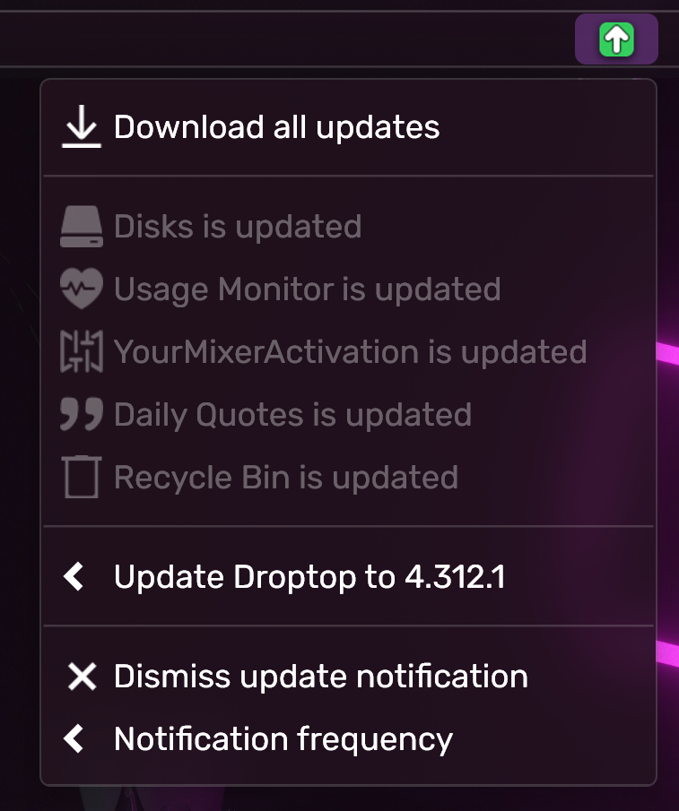

# 🔼 Updating

## Automatic detection

When an update is available for Droptop, a green notification icon will automatically appear in the top bar on all PCs connected to the internet.

<figure><figcaption></figcaption></figure>


Through the Update Notification app, if any active Community Apps have updates available, they can be downloaded automatically by pressing `Download all updates"`


After the download is finished, launch the `.rmskin` install file to complete the update.


If you receive an error check [#i-cant-install-the-update](../help/faqs.md#i-cant-install-the-update "mention")


## Hiding the update notification

Press the `Dismiss update notification` to remove the green notification icon until the next update is available, or the next time you restart your PC.

Select "Don't notify me" to never show the green notification icon again. To manually check for updates, go to `Droptop settings >> Support >> Check online for an update` or you can check for updates on our [Discord Server](https://droptopfour.com/discord) #Annoucements channel.
