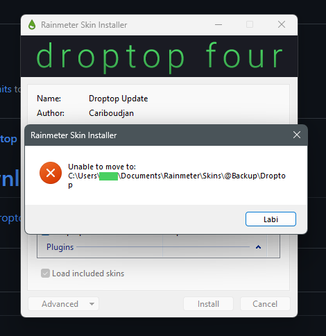

# ❓ FAQs

## I paid for the Supporter Version, but lost it.

<mark style="color:yellow;">**Problem:**</mark> Need to restore Supporter Version purchase.



&#x20;<mark style="color:yellow;">**Check your email for the download link**</mark>&#x20;

1. Go to your email provider (Gmail, Outlook, etc.)
2. Search your inbox for "Droptop" or "Gumroad", and see if you have a download link
   * If you have only an invoice of the payment, send it to an administrator of the [discord server](https://discord.droptopfour.com) and you'll be added to a channel where you'll find the supporter version


Note: Droptop's core (basic version) needs to be installed prior to applying the "Supporter Version" upgrade




## I can't install the update

<mark style="color:yellow;">**Problem:**</mark> Receiving an error when installing the update

<figure><figcaption></figcaption></figure>



<mark style="color:yellow;">**Close any programs that may be accessing any files inside Droptop, and try the installer again. If this doesn't solve the problem, simply log off of your Windows account, log back in, and try the installer again.**</mark>



## I want to change the name of an application in the bar

<mark style="color:yellow;">**Problem:**</mark> An application I'm using isn't the name I want displayed on the bar



<mark style="color:yellow;">**Create your own substitution**</mark>

1. To add your own substitution, with the app selected, click on the application's name in the Droptop bar
2. In the dropdown menu, select "More options", then "Change app name".
3. The file UserSettings.inc will open. In this file, find the variable `UserAppSubstitutions=`
4. Select the end of this line. A template for a new app substitution has been added to your clipboard. Select the end of this line and paste (Ctrl + V)
   * The end of the line would look like, for example: `,"Discord":"NEW-APP-NAME"`
5. Replace `NEW-APP-NAME` with your application's new name.
   * **Tip:** If the first character of the application's name is a lowercase letter (eg. iTunes), use a non-space character as the first letter in your substitution. For example: `,"iTunes","[\x200B]iTunes"`
   * Tip: If the substitution doesn't work, try adding `(?is)` to the beginning of your app name to make the line case-insensitive. For example: `,"(?is)Explorer":"Finder"`


Substitutions use RegEx..\
Must be exact words and is case-sensitive




## Droptop is running slowly

<mark style="color:yellow;">**Problem:**</mark> Droptop is slow

Solution: Try...



<mark style="color:yellow;">**Enable Hardware Acceleration**</mark>

1. Right-click on the Rainmeter icon in the Windows system tray (it's rain drop shaped)
2. Select "Manage"
3. Select the "Settings" tab
4. Check box "Use hardware acceleration (Requires restart)"
5. Right click on an empty portion of the Droptop bar. Select More options >> Restart Rainmeter.


Some PCs may have issues with hardware acceleration turned on, including slower performance and graphical glitches. If these occur, disable hardware acceleration




<mark style="color:yellow;">**Disable**</mark><mark style="color:yellow;">** **</mark><mark style="color:yellow;">**`Use heavy blur`**</mark>

1. Go to Droptop settings >> Options >> Blur effects
2. Disable "Use heavy blur effect">
3. Note: This setting is theme-specific. You may need to re-disable this setting if you switch to another theme.


Some PCs may have issues with hardware acceleration turned on, including slower performance and graphical glitches. If these occur, disable hardware acceleration




<mark style="color:yellow;">**Disable**</mark><mark style="color:yellow;">** **</mark><mark style="color:yellow;">**`Log to file`**</mark>

1. Right-click on the Rainmeter icon in the Windows system tray (it's rain drop shaped)
2. Select `Manage`
3. Select the `Settings` tab
4. De-select `Log to file`



## How do I optimize Droptop for good battery life?


Although Droptop uses very few resources when sitting idle in the background, you may want to optimize Droptop for extended laptop battery life. Here are some solutions:


<mark style="color:yellow;">**Problem:**</mark> I need to maximize my battery life



<mark style="color:yellow;">**Disable unused system tray apps**</mark>

1. Right-click on a system tray app in the top-right corner
2. De-select any apps you don't frequently use. Apps can be re-enabled later at any time.



<mark style="color:yellow;">**Enable**</mark><mark style="color:yellow;">** **</mark><mark style="color:yellow;">**`Game mode`**</mark>

1. When not using Droptop for an extended period of time, you can go to the Windows system tray, right-click on the Rainmeter icon (the rain drop icon), and select "Game mode". Droptop will deactivate completely
2. To reactivate Droptop, de-select the "Game mode" option.



## My Music & videos aren't showing up in the Volume app or on the top bar

<mark style="color:yellow;">**Problem:**</mark> Not displaying song title & artist in the Volume app



<mark style="color:yellow;">**Install the latest version of WNPRedux for your players**</mark>

* **Chrome**: [Chrome Web Store](https://chrome.google.com/webstore/detail/webnowplaying-redux/jfakgfcdgpghbbefmdfjkbdlibjgnbli)
* **Firefox**: [Mozilla Addon Store](https://addons.mozilla.org/en-US/firefox/addon/webnowplaying-redux)
* **Desktop players**:  Works out of the box


Spotify doesn't need anymore Spicetify to work with Rainmeter, as long you have installed a version of the WNP plugin > 2.0.0



For further informations about supported players and websites visit [https://github.com/keifufu/WebNowPlaying-Redux#readme](https://github.com/keifufu/WebNowPlaying-Redux#readme)




<mark style="color:yellow;">**Restart Rainmeter or restart your PC.**</mark>



## My weather, browser media, or email aren't updating

<mark style="color:yellow;">**Problem:**</mark> The webparser or plugins aren't retrieving data



<mark style="color:yellow;">**Exit and re-open Rainmeter**</mark>

1. Go to the Droptop "Home" button in the top-left corner >> select `Restart Rainmeter` >> Restart Rainmeter now



<mark style="color:yellow;">**Check your internet connection and/or restart your PC.**</mark>



## Gmail isn't working

<mark style="color:yellow;">**Problem**</mark><mark style="color:yellow;">:</mark> Unread email isn't appearing in the Gmail app



<mark style="color:yellow;">**Using 2-Step Verification? Create an app password for use with Rainmeter & Droptop**</mark>

1. In Security settings of your Gmail account, navigate to "App passwords"
2. Under the "App" dropdown menu, select "Other"
3. Type "Droptop" and press enter
4. Google will generate a password for you. Copy the password
5. In `Droptop settings >> Options >> Apps >> Mail` menu, paste the password into the password field and press enter



<mark style="color:yellow;">**Check your Gmail account settings**</mark>

1. In the `Droptop settings >> Options >> Apps >> Mail` menu, set your Gmail username and paste the app password provided in Solution
2. Press enter to confirm your entry after typing



## My game detects a violation

<mark style="color:yellow;">**Problem:**</mark> My game doesn't start cause it detects a security violation



<mark style="color:yellow;">**Use Rainmeter Gamemode**</mark>

Take a look at the documentation for the [Rainmeter Gamemode](https://docs.rainmeter.net/manual/user-interface/manage/#GameModeTab), and configure it the way you like


Rainmeter Gamemode documentation



