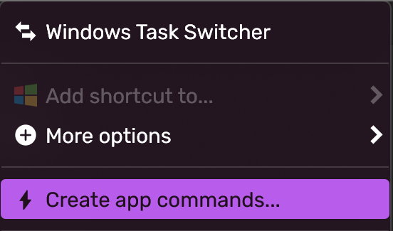
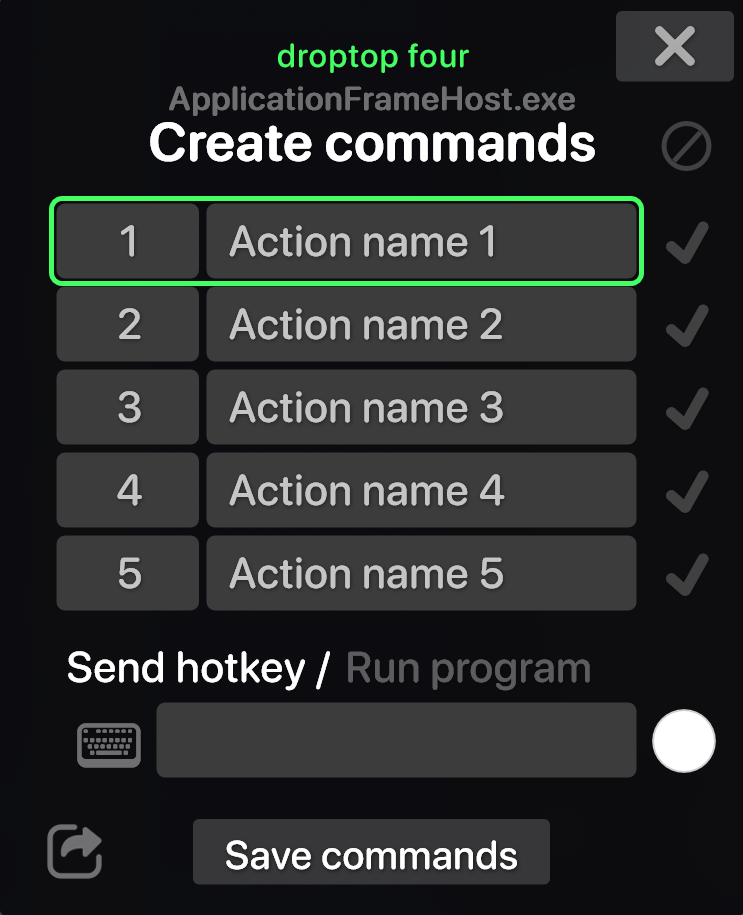

# 🔅 Create custom app commands


To create custom commands you have to have a basic understanding of how [AutoHotKey](https://www.autohotkey.com/) works. Droptop uses `ahk` scripts to simulate hotkeys press to execute your command.


To create you app commands, click on the app menu you see on the bar (if you have that disabled check [#show-application-menu](../setting-up/behaviour/general-folders-options/#show-application-menu "mention")) and if you still haven't created any app command, you have to click on the `Create app commands...` button.

<figure><figcaption></figcaption></figure>

If you already have some commands, go to `More options >> Define hotkeys`.

After clicking on the button, a pop-up will appear where you can set you app commands.

<figure><figcaption>
The Create commands tool
</figcaption></figure>

1. Select any row to put a command
2. Double click on the `Action name #` and put the name of the action that command will perform
3. Instead of the number you can put an unicode emoji to identify the command on the droptop bar if you enabled the [#show-application-commands](../setting-up/behaviour/general-folders-options/#show-application-commands "mention") option
4. On the bottom chose if the action the command will perform is an hotkey or if it has to run a program, and select accordingly&#x20;
   * If you want to execute an hotkey, write the hotkey command to be sent by AutoHotKey. To help you with the configuration you can click on the keyboard icon that will display an interactive keyboard that will complete the hotkey easily
   * If you want to run a program, paste the path of the program you want to launch
5. Chose a color of the command by clicking on the white dot and adjust the RGB values to reach the color you want
6. Click save commands to close the tool, and the commands will be available right away


Remember to click enter when you finish writing


## Share your commands

If you want to share your commands for a specific app with someone, open the tool again and click on the share button. Your commands will be compiled and a folder with an `.rmskin` of your commands will open. Share that file to anyone that needs it!


A Powershell window could appear during compiling, that's normal

