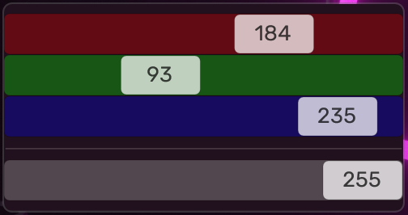

# Color & opacity

To personalize your Droptop Four bar you can change its colors and opacity of every component. Just head to `Droptop settings >> Color & opacity` and start changing the colors to the ones you like.

In every color setting you'll find 3 sliders to adjust the RGB (Red, Green, Blue) values and one slider to adjust the opacity of the color you chose.

<figure><figcaption>
Color settings
</figcaption></figure>

## Top bar background

This color is the background of the bar.&#x20;

## Top bar text

The color of all the text on the top bar.&#x20;


This includes the color of the home icon if you are using a white icon and you disabled the icon colors. See[#icon-colors](home-icon.md#icon-colors "mention") for other options.


## Dropdown background

The color of the background of every dropdown element (options, app, dialog) that isn't the top bar.

## Dropdown text

The color of the text of every dropdown element (options, app, dialog) that isn't the top bar text.

## Top bar highlight

The background color of every highlighted element on the top bar.

## Top bar highlight text

The text color of every highlighted element on the top bar.

## Dropdown highlight

The background color of every highlighted element in any dropdown element (options, app, dialog) that isn't on the top bar.

## Dropdown highlight text

The textcolor of every highlighted element in any dropdown element (options, app, dialog) that isn't on the top bar.
