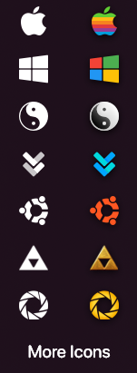
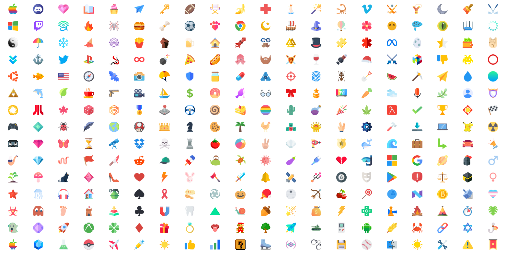

# Home icon

If you want to change the icon shown on the home button of droptop, you have some options:

## Icons

### Default icons

If you click on `Droptop settings >> Set home icon` you can find some icon presets you can choose from. If you have the Supporter version, you'll find 300 different icons, if you have the Basic version only, you'll find only 7.




<figure><figcaption></figcaption></figure>




<figure><figcaption></figcaption></figure>



### Custom icons

If the icon you want isn't present between the default ones, you can load a custom one yourself!

Click the  button in the `Droptop settings >> Set home icon` button, select the image you want to use, click `Open`, wait a moment and your custom icon should be set!

### Random icon

You don't want to select an icon because you are lazy? Use the  button in the `Droptop settings >> Set home icon` button to select a random icon between all the default ones!

## Icon colors

If the icon you chose is multicolor, you have to make sure you enable the multicolor option in the `Droptop settings >> Set home icon`  button.&#x20;

If you icon is white, you can change it's color by changing the `Top bar text` color from the `Droptop settings >> Color & opacity` menu ([#top-bar-text](color-and-opacity.md#top-bar-text "mention")).
