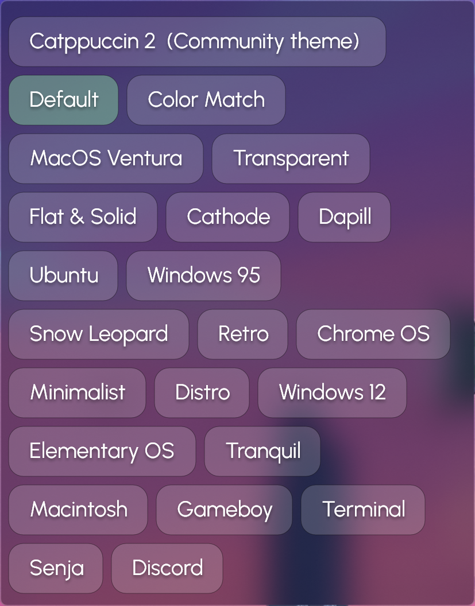

# Themes

If you want to change the majority of all the settings we talked befour, you might want to take a look at droptop's themes.

## Default themes

In the `Droptop settings >> Themes` menu you'll see all the default themes you can use.

If you have the Basic version you'll be able to use only 4 themes, with the Supporter version you'll be able to use all the 22 default themes.



<figure><figcaption>
Unlocked and locked themes for the Basic version
</figcaption></figure>



<figure><figcaption>
All the themes are unlocked with the Supporter version
</figcaption></figure>



## Community themes

Everyone in the droptop community can also create it's personalized themes, and share them with all of the people that might be interested. Those themes use popular color schemes or completely subjective palettes.

The list of all the community themes is on the website:



## Create your community theme

If you want to create a personalized community theme that isn't already made, head to [Broken link](broken-reference "mention") to learn more.
