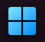

# General folders options

## Middle click behaviour

You can chose the action to perform when middle-clicking on an item of a folder. Go to `Droptop settings >> Options >> Menu options >> Middle-clicking on folder items...` and change the selected option.

You can choose between:

* Open file or folder
* Open file or folder properties
* Do nothing

## Show start button

If you want to show on the droptop bar a button to show the Windows Start menu, you can enable the option by right clicking on any folder you have enabled on the bar and toggle the `Show Start button` option.

<figure><figcaption>
Highlighted the Show Start button option
</figcaption></figure>

<figure><figcaption>
Droptop with option enabled
</figcaption></figure>

By clicking the  button, the Windows Start menu will appear

## Show application menu

If you want to display on droptop the name of your currently focused app, you have to have enabled the `Show application menu` option.&#x20;

<figure><figcaption></figcaption></figure>

When you click on the name of the application, you'll find a list of actions you can perform, and if you have them, you'll find also the application commands you created for that app.


If you want to know how to create your custom app commands, head to [Broken link](broken-reference "mention")


## Show application commands

if you want to show your application commands on your bar to be easy accessible, enable the `Show app commands` option.

<figure><figcaption></figcaption></figure>


If you want to know how to create your custom app commands, head to [Broken link](broken-reference "mention")


## Add shortcut to a folder

If you want to add an app to a droptop folder, open the app, click on the app name and select the `Add shortcut to` button, then select the folder you want to have the shortcut in, and you're done!&#x20;

Else you can drag & drop files and folders opening the `Documents\Rainmeter\Skins\Droptop Folders` directory, choosing the folder you want to add what you want to, and refreshing droptop.
