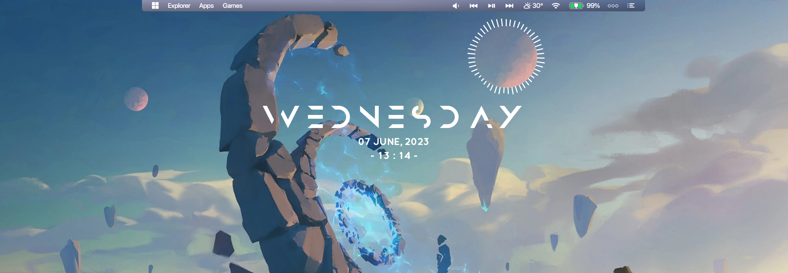

# Menu options

## Hot corners

Droptop has 2 hot corners on the left and right side of the bar. You can change their behaviour in `Droptop settings >> Options >> Menu options >> Left hot corner action` and `Droptop settings >> Options >> Menu options >> Right hot corner action`. They can be also disabled.

<figure><figcaption>
Hot corner highlighted
</figcaption></figure>

## Bar centering

If you have a very wide screen, the lenght of the droptop bar can be quite annoying. Luckily you can shorten the bar in the center by adding a desired offset in `Droptop settings >> Options >> Menu options >> Top bar centering`.&#x20;

<figure><figcaption>
Screenshot by ChiefPoko
</figcaption></figure>

## Accessibility in fullscreen apps

If you have a fullscreen window, droptop won't show on top of the open window. If you want to have access to droptop when using a fullscreen window, enable `Droptop settings >> Options >> Menu options >> Accessibility in fullscreen apps`.&#x20;


Enabling this option can cause some problems while gaming, as the bar could appear and steal the focus of the cursor from your game. We suggest to set the [Rainmeter Gamemode](https://docs.rainmeter.net/manual/user-interface/manage/#GameModeTab) to be able to safely game also saving up on performances.&#x20;


## Simplified home menu

If you want to use the droptop home menu as your main home menu, you might want to hide the settings tab and use a simple and clean version of the home menu that shows some useful buttons. To enable it, toggle `Droptop settings >> Options >> Menu options >> Simplified home menu`.
