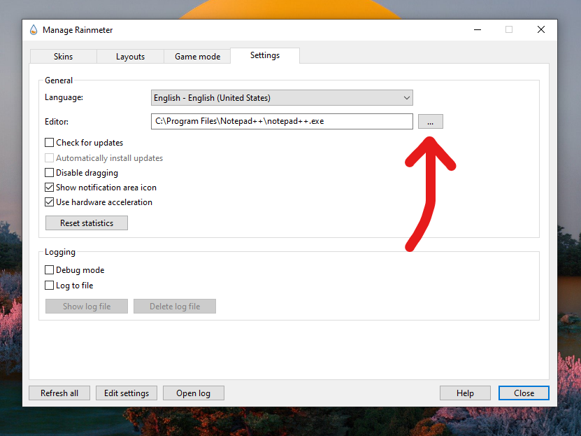
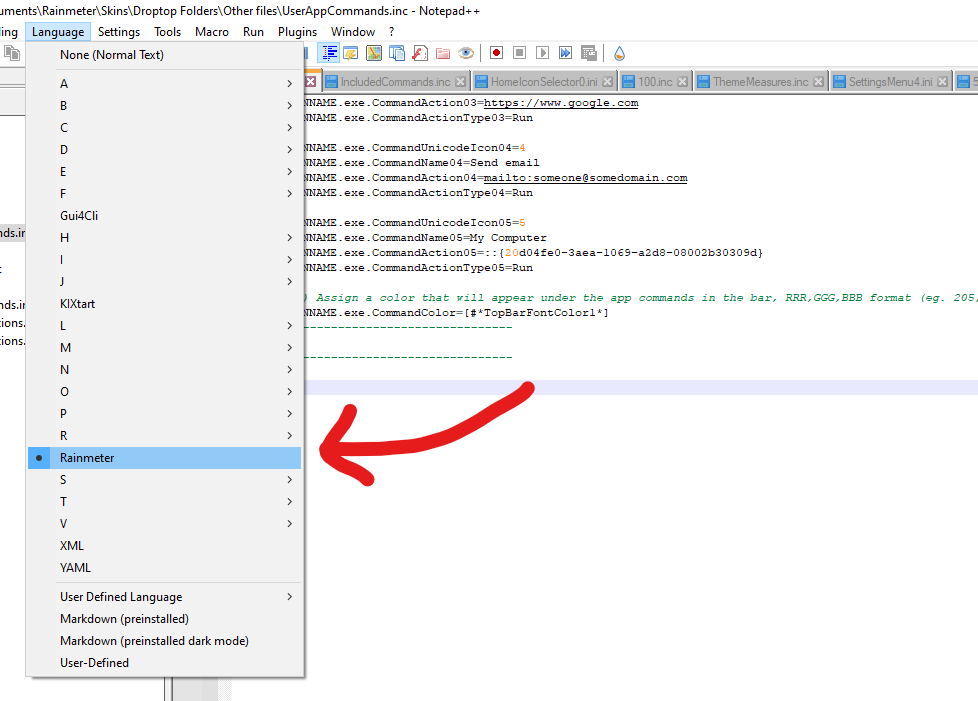
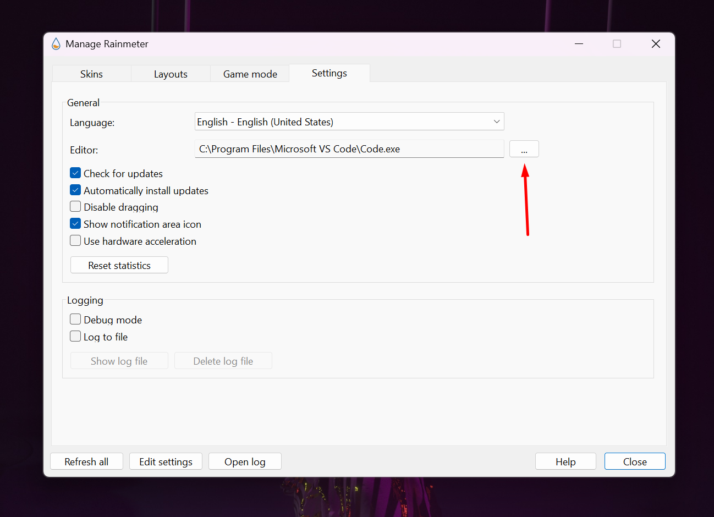

# ✍ Rainmeter editor

It's recommended you install an **advanced editor** instead of using the Windows Notepad to work on your Rainmeter projects and files, since they usually offers a lot of useful functions, like **syntax highlighting** or **errors recognition**.

The two editors we recommend are:

[#notepad++](rainmeter-editor.md#notepad++ "mention")

[#visual-studio-code](rainmeter-editor.md#visual-studio-code "mention")

## Notepad++

You can download **Notepad++** from its official website here: [https://notepad-plus-plus.org/downloads/](https://notepad-plus-plus.org/downloads/). Set **Notepad++** as your official editor for Rainmeter by following these steps:&#x20;

1. In the system tray, right-click on the Rainmeter icon
2. Select `Manage`
3. Go to the `Settings` tab
4. Next to `Editor`, select the `...` button
5. Navigating to the Notepad++ executable in `C:\Program Files\Notepad++\notepad++.exe` _(The installation path could change from user to user)_

<figure><figcaption>
Enable <strong>Notepad++</strong> as default Rainmeter editor
</figcaption></figure>

6. It's also recommended you install the addon for Notepad++ called **RainLexer**. [https://poiru.github.io/rainlexer/](https://poiru.github.io/rainlexer/)
7. Restart Notepad++ and in the Notepad++ menu bar, go to `Language` and select `Rainmeter`

<figure><figcaption>
Enable the Rainmeter linguage <strong>syntax highlighting</strong>
</figcaption></figure>

## Visual Studio Code

You can download **VSCode** from its official website here:[https://code.visualstudio.com/download](https://code.visualstudio.com/download). Set **VSCode** as your official editor for Rainmeter by following these steps:&#x20;

1. In the system tray, right-click on the Rainmeter icon
2. Select `Manage`
3. Go to the `Settings` tab
4. Next to `Editor`, select the `...` button
5. Navigating to the Notepad++ executable in `C:\Program Files\Notepad++\notepad++.exe` _(The installation path could change from user to user)_

<figure><figcaption>
Enable <strong>VSCode</strong> as default Rainmeter editor
</figcaption></figure>

6. It's also recommended you install the extension for VSCode called **Rainmeter Support**. [https://marketplace.visualstudio.com/items?itemName=will-shaw.ws-rainmeter](https://marketplace.visualstudio.com/items?itemName=will-shaw.ws-rainmeter)
7. Restart **VSCode**
